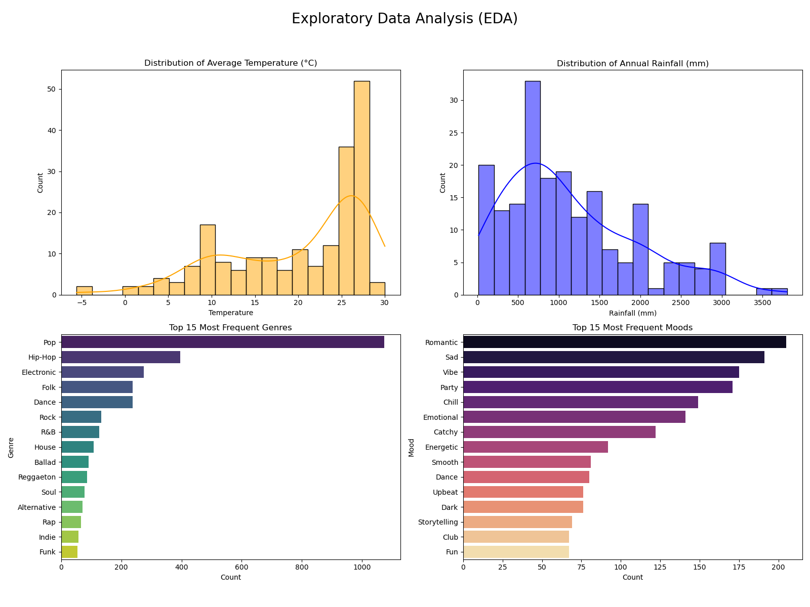
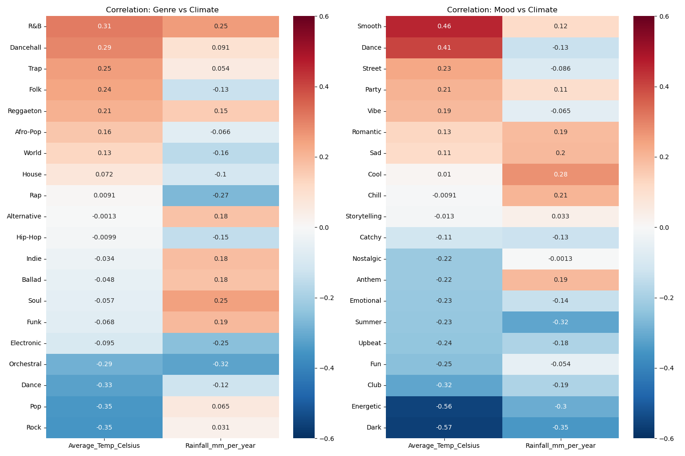
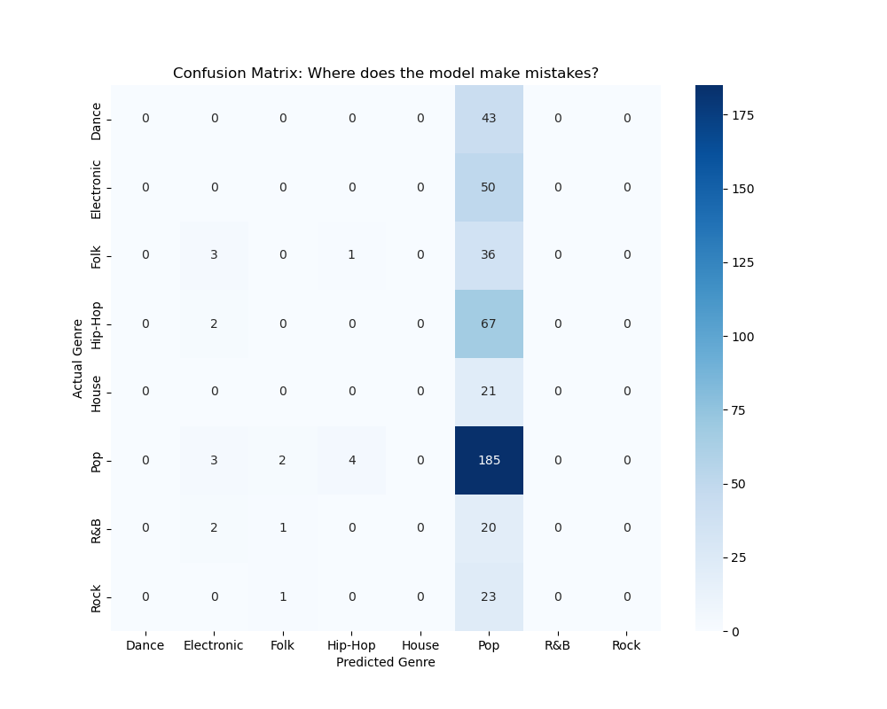
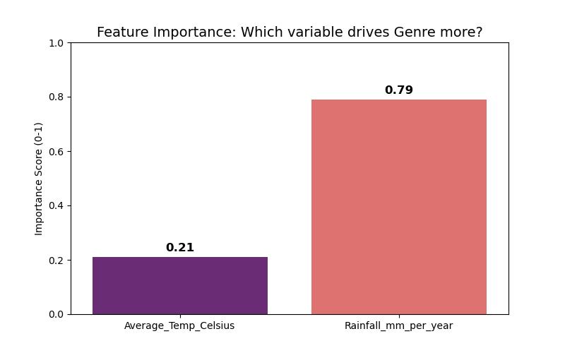
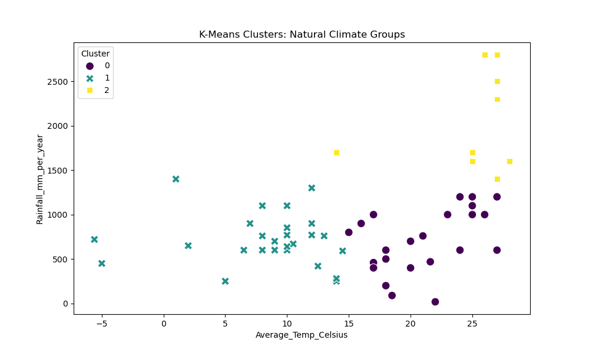

# DSA210 Term Project: Global Music Trends & Climate Analysis
**Student:** Elif Özkaya
**Course:** DSA 210 – Introduction to Data Science
**Term:** Fall 2025-2026

---

## 1. Introduction

### 1.1 Motivation
Climate exerts a tangible influence on human culture, visible in our clothing, architecture, and cuisine. This project explores a more subjective cultural artifact: **Music**. Do environmental factors like temperature and rainfall subconsciously shape the "vibe" of the music a nation consumes? For instance, do hotter countries gravitate towards high-energy Pop/Dance music, while colder nations prefer darker, more intense genres?

Combining a personal interest in music chart statistics with environmental data, this study analyzes the "Top 30" music charts from 68 countries to identify statistically significant correlations between climate and musical preference.

### 1.2 Objectives
* To aggregate and clean music popularity data from 68 countries.
* To correlate musical attributes (Mood, Genre) with environmental metrics (Temperature, Rainfall).
* To test specific hypotheses regarding "Winter Melancholy" and "Sunny Dispositions."
* To build a Machine Learning model to predict music taste based on climate data.
* To deploy an interactive Web Application for visualizing these trends.

---

## 2. Data & Methodology

### 2.1 Data Sources
The dataset was constructed by aggregating three distinct sources:
1.  **Music Popularity:** Scraped from **Shazam Top 200 Charts** (Week of Oct 21-27, 2025). We isolated the Top 30 songs for 68 countries.
2.  **Audio Features (Genre/Mood):** Since standard APIs (Spotify/Shazam) provided incomplete metadata, **AI Annotation** (Gemini) was used to classify songs into Genres (e.g., Pop, Rock) and Moods (e.g., Dark, Chill, Energetic).
3.  **Climate Data:** Average Temperature and Annual Rainfall data were aggregated from **The World Bank (CCKP)** and the **Climatic Research Unit (CRU)**.

### 2.2 Data Processing Pipeline
* **Cleaning:** Standardized country names (e.g., mapping "United Arab" to "United Arab Emirates") to ensure a successful merge.
* **Feature Engineering:** Utilized "Explosion" techniques to split compound genres (e.g., "Pop / Hip-Hop") into distinct entries for accurate counting.
* **Normalization:** Calculated the *proportion* of genres per country (rather than raw counts) to account for playlist size variations.

---

## 3. Exploratory Data Analysis (EDA)

Before hypothesis testing, we visualized the global distribution of music and climate to understand the dataset's structure.

*Figure 1: Exploratory Data Analysis (EDA). Top Left: The temperature distribution is left-skewed, showing a high concentration of countries in warmer climates (25°C+). Bottom Left: A severe class imbalance is visible, with 'Pop' music (>1000 songs) vastly outnumbering the second most common genre, 'Hip-Hop' (~400 songs).*

**Key Observations:**
* **Genre Dominance:** "Pop" music is the overwhelming favorite globally (29% of dataset), creating a class imbalance that impacts later modeling.
* **Climate Spread:** The dataset covers a wide range of climates, from cold northern European nations to tropical equatorial countries.

---

## 4. Hypothesis Testing

We performed **Pearson Correlation Tests** to validate three specific theories.

*Figure 2: Pearson Correlation Heatmaps. Right Chart (Moods): There is a strong negative correlation between Temperature and high-intensity moods like 'Dark' (r = -0.57) and 'Energetic' (r = -0.56), supporting the "Winter Melancholy" hypothesis. Conversely, 'Smooth' (r = 0.46) and 'Dance' (r = 0.41) moods show a positive correlation with warmer temperatures.*

### 4.1 The "Winter Melancholy"
* **Hypothesis:** Colder countries prefer darker, more intense music.
* **Result:** **Strongly Supported**
* **Statistics:** Pearson r = -0.57 (P < 0.00001).
* **Conclusion:** There is a strong negative correlation between Temperature and "Dark" mood scores. As temperature drops, the popularity of melancholic and intense music rises significantly.

### 4.2 The "Sunny Disposition"
* **Hypothesis:** Warmer countries prefer high-energy, positive music.
* **Result:** **Supported**
* **Statistics:** Pearson r = 0.41 (P = 0.0006).
* **Conclusion:** Warmer climates show a distinct statistical preference for "Dance" and "Smooth" moods.

### 4.3 The "Rainy Day Vibe"
* **Hypothesis:** Countries with higher rainfall prefer calmer ("Chill") music.
* **Result:** **Not Supported**
* **Statistics:** Pearson r = 0.21 (P = 0.096).
* **Conclusion:** While a positive trend exists, the P-value is not low enough to be statistically significant. Rainfall is a weaker predictor of mood than temperature.

---

## 5. Advanced Climate Analysis

To deepen the understanding of how climate zones affect genre preference, we visualized distribution ranges and zone-specific popularity.

*Figure 3: Advanced Climate-Music Analysis. Top Left: Boxplots show that genres like 'R&B' and 'Reggaeton' have tighter distributions in warmer climates, while 'Rock' and 'Folk' span a wider range of colder temperatures. Bottom Left: Comparing Hot vs. Cold zones reveals that 'Party' and 'Romantic' moods are more prevalent in Hot Zones (Red bars), whereas 'Dark' and 'Energetic' moods dominate Cold Zones (Blue bars).*

---

## 6. Machine Learning Analysis

We applied Machine Learning to move beyond correlation and test predictive capability.

### 6.1 Decision Tree Classifier
* **Goal:** Predict a song's Genre based solely on Temperature and Rainfall.
* **Performance:** The model achieved **40% Accuracy**. While low in absolute terms, this is significantly better than random chance (12.5% for 8 classes).

*Figure 4: Confusion Matrix for the Decision Tree Classifier. The dark blue cell (185) indicates the model correctly identified 'Pop' songs. However, the light blue cells in the 'Pop' column (e.g., 67 Hip-Hop songs misclassified as Pop) reveal that the model is biased toward the majority class due to the data imbalance.*

* **Feature Importance:** Surprisingly, the Decision Tree identified **Rainfall** as a more critical splitting factor than Temperature for classifying specific genres, despite Temperature having stronger linear correlations.

*Figure 5: Feature Importance Scores. Contrary to the initial hypothesis that temperature drives preference, the Decision Tree identified 'Annual Rainfall' (Score: 0.79) as the dominant predictor for genre classification, significantly outweighing 'Average Temperature' (Score: 0.21).*

### 6.2 K-Means Clustering
* **Goal:** Group countries into natural "Climate-Music Zones."
* **Result:** The Elbow Method indicated **k=3** as the optimal number of clusters (Cold, Moderate, Hot).
* **The "Pop Universality" Discovery:** Pop music was the dominant genre in *all three* clusters. This suggests that the globalization of Pop music is robust enough to overpower the subtler effects of local climate.

*Figure 6: K-Means Clustering Results. The algorithm identified three distinct climate zones: Cluster 1 (Teal) represents cooler, moderate-rainfall countries; Cluster 0 (Purple) represents warm, dry-to-moderate climates; and Cluster 2 (Yellow) represents regions with extreme rainfall.*

---

## 7. Web Application Development

To make these findings accessible, an interactive dashboard was developed using **Streamlit**.

* **URL:** [https://climate-music-corelation-dsa210-elif-ozkaya.streamlit.app/](https://climate-music-corelation-dsa210-elif-ozkaya.streamlit.app/)
* **Tech Stack:** Python, Streamlit, Altair, Pandas.

**Key Features:**
1.  **Interactive Scatter Plots:** Users can filter countries by specific Moods and hover over data points to see real-time climate stats.
2.  **Hypothesis Storytelling:** The app is structured into tabs that guide the user through the narrative of the three hypotheses (Winter, Sunny, Rainy).
3.  **Dynamic Filtering:** A sidebar allows users to adjust the "Top N" moods displayed, dynamically updating the visualizations.

---

## 8. Limitations & Future Work

* **Class Imbalance:** The dataset is heavily skewed towards Pop music. Future iterations should use **SMOTE (Synthetic Minority Over-sampling Technique)** to help the model learn niche genres like Rock or Folk.
* **Time Series Analysis:** This study represents a "snapshot" of October 2025. To analyze seasonality (e.g., "Do cold countries listen to summer hits in July?"), data collection over a full 12-month cycle is required.
* **Confounding Variables:** Economic factors (GDP) likely correlate with both climate and music market maturity. A Causal Inference study is needed to control for these variables.

---

## 9. AI Usage Disclaimer
In this project, I utilized AI tools (Gemini) to assist with:
1.  **Data Annotation:** Generating Genre and Mood tags for songs where API data was missing.
2.  **Coding Support:** Debugging Streamlit deployment and optimizing Pandas merge operations.
All statistical analysis, hypothesis formulation, and final conclusions were verified and validated manually.

---

## 10. References & Tools
* **Libraries:** `pandas`, `numpy`, `matplotlib`, `seaborn`, `scikit-learn`, `statsmodels`, `altair`, `streamlit`.
* **Data:** Shazam Top 200 Charts, World Bank Climate Knowledge Portal.
